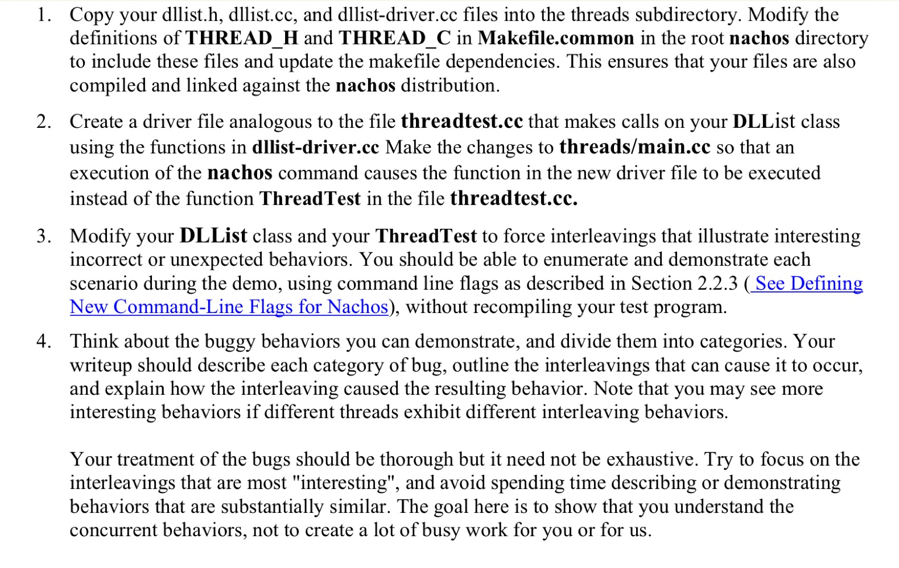

[toc]
# lab1
[nachos-labs.pdf](../nachos-labs.pdf)
>The Trouble with Concurrent Programming



## 实验一理解
nachos是一个小型的系统，在thread文件夹下可以管控的几个子系统有线程管理，文件管理，网络管理等这几个子系统。  
我们在运行nachos时，会要求我们输入对应的命令来给系统传送参数，上面所述的三个系统都有对应的传送命令，另外，nachos还提供整个系统本身带有的一些命令，如debug等功能，具体用法如下  
```shell
Usage: nachos -d <debugflags> -rs <random seed #>
		-s -x <nachos file> -c <consoleIn> <consoleOut>
		-f -cp <unix file> <nachos file>
		-p <nachos file> -r <nachos file> -l -D -t
             -n <network reliability> -m <machine id>
             -o <other machine id>
             -z

   -d causes certain debugging messages to be printed (cf. utility.h)
   -rs causes Yield to occur at random (but repeatable) spots
   -z prints the copyright message

 USER_PROGRAM
   -s causes user programs to be executed in single-step mode
   -x runs a user program
   -c tests the console

 FILESYS
   -f causes the physical disk to be formatted
   -cp copies a file from UNIX to Nachos
   -p prints a Nachos file to stdout
   -r removes a Nachos file from the file system
   -l lists the contents of the Nachos directory
   -D prints the contents of the entire file system 
   -t tests the performance of the Nachos file system

 NETWORK
   -n sets the network reliability
   -m sets this machine's host id (needed for the network)
   -o runs a simple test of the Nachos network software

```

当然我们也可以自己设计命令在nachos里面  
>For a quick peek at what's going on, run nachos -d ti to activate the DEBUG statements in threads and machine . If you want to know more, add some more DEBUG statements. You are encouraged to sprinkle your code liberally with DEBUG statements, and to add new debug flag values of your own


## 建立双向链表
实验要求实现的类如下
```cpp
class DLLElement {
public:
DLLElement( void *itemPtr, int sortKey ); // initialize a list element

    DLLElement *next; // next element on list
    // NULL if this is the last
    DLLElement *prev; // previous element on list
// NULL if this is the first
int key; // priority, for a sorted list
void *item; // pointer to item on the list
};
class DLList {}
public:

    DLList(); // initialize the list
    ~DLList(); // de-allocate the list
    void Prepend(void *item); // add to head of list (set key = min_key-1)
    void Append(void *item); // add to tail of list (set key = max_key+1)
    void *Remove(int *keyPtr); // remove from head of list
    // set *keyPtr to key of the removed item
    // return item (or NULL if list is empty)
    bool IsEmpty(); // return true if list has elements
    // routines to put/get items on/off list in order (sorted by key)
    void SortedInsert(void *item, int sortKey);
    void *SortedRemove(int sortKey);  // remove first item with key==sortKey
    // return NULL if no such item exists
    void show() // this function is add by our team,used to show this list

private:

    DLLElement *first; // head of the list, NULL if empty
    DLLElement *last; // last element of the list, NULL if empty
};
```

- [dllist-driver.cc](dllist-driver.cc)
- [dllist.cc](dllist.cc)
- [dllist.h](dllist.h)


## 调用双向链表insert 和remove
这个使用到的是dllist-driver.cc的函数  
- InsertList
    - 这个函数生成N个随机的key,item设置为一个int,由于需要全局使用，随意使用堆的空间(new)
    - 这里涉及到了分配的空间如何回收的问题(gc),由于和本次实验关联不大,这里就不深究了
- RemoveList
  - 这个函数实现的是将之前的链表删除

## 人为制造错误
nachos的线程管理是维护一条进程队列  
main是我们进入系统后的第一条进程，这个进程,在这个实验中的任务是把我们设计的进程放到进程队列中,其余进程自己决定其功能，在nachos中，所有的进程跳转，结束等操作都通过定义的全局变量currenthread来实现，通过该变量进行线程空间的回收等  
  
以下是一些关于此次实验的**一些方法**:  
```cpp
// 创建一个进程
Thread *t = new Thread(name);

// 进程进入队列
t->Fork(fun,arg);

// 结束进程
currenthread->Finish();

// 进程跳转
currenthread->Yield();
```


